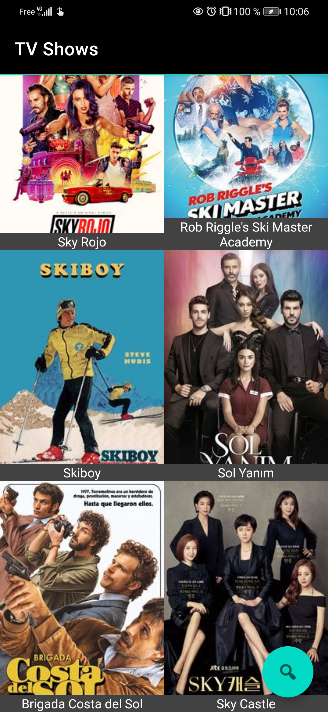
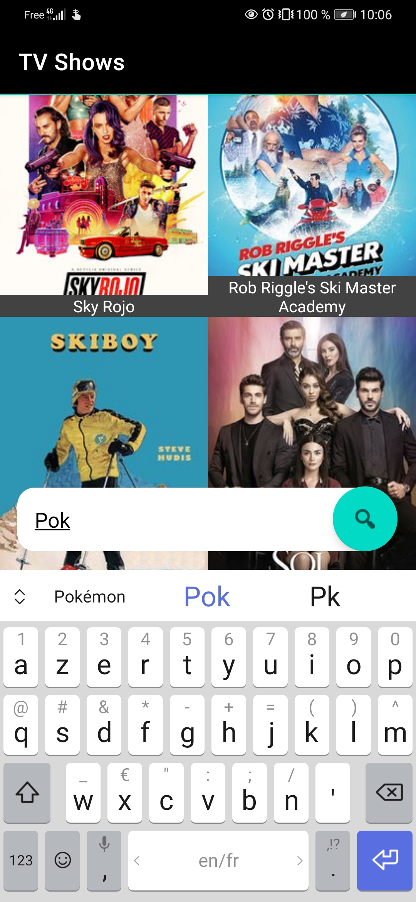
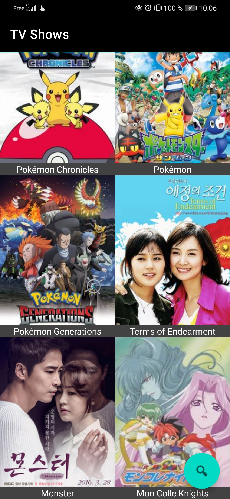
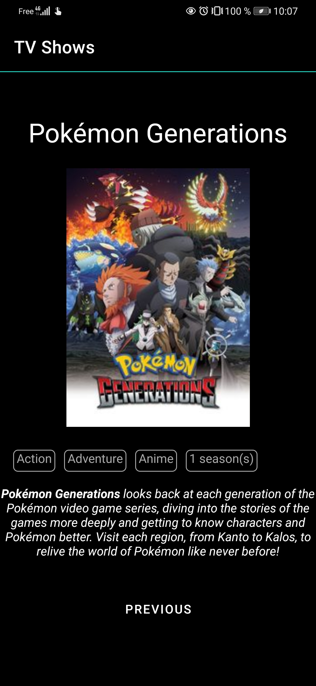

#    Projet_Mobile_TV_Show
Projet mobile 3A : Accès aux informations liées à un tv show via l'api rest TVmaze, le but étant de permettre à l'utilisateur de faire une recherche de show, de lui proposer les 10 meilleurs résultats retournés par TVmaze et d'afficher le détail d'un élément lorsque celui-ci est selectionné depuis la liste. La dernière recherche effetuée est stockée en cache afin de faciliter la navigation dans l'application même si celle-ci est relancée.
Réalisé par Thomas Abriat - Classe 32

### Version Stable Courante : v2 (master) ###

### Captures d'écran ###

### Infos Pratiques ####

Un fichier apk de la dernière version stable est disponible dans le dossier apk 
Les branches features ont étés volontairement conservées afin de que l'on puisse observer le gitflow du projet
